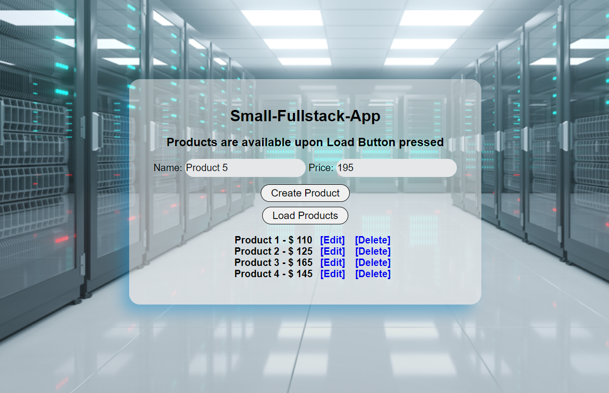

<h1 align="center">Small-Fullstack-App</h1>
<h2 align="center">This App Contains the Logic of a SPA+REST Api</h2>

&nbsp; &nbsp; &nbsp;In my **Small-Fullstack-App** I implement the Logic of Both **Frontend** and **Backend parts** of a **Modern Web Application**. It plays the role of a **Static Server(CDN)** and **Content Server(REST Api)** that holds the **Data** and operates with it. The Application has a dynamic **Frontend** part that sends a fetch requests to **Create**, **Read**, **Update** and **Delete** a **Resource** from the **REST Api** without **Reloading the Page**. The **REST Api** sends the **Data** to the **Frontend** in a **JSON** format and the **Frontend** does its **Logic** with it. The **Requests** are made from the same URL where the **REST Api** is and **(CORS)Errors** are not hit. The **Browser** allows it.

&nbsp; &nbsp; &nbsp;The **Small-Fullstack-App** has an **'in Memory DB'** (the Data is stored in the Memory of the **REST Api**) with three Products initially in it. The user can **Create** more **Products**, **Load(READ)** all Products and see them on the Page, **Edit(UPDATE)** a single Item and **DELETE it**. All this **Interactions** are made with the **Client Javascript on the Frontend**, rather than with the **Browser's Default Behaviour via Forms**. 
The **Submit Button** in the **Form** is **Interactive** and changes its Text and Logic, depending on the user's choice whether to **Edit(UPDATE)** a Product or **CREATE** one more. 

## Created with:

- Node.js + Express.js
- Vanilla JS
- HTML & CSS

To run Small-Fullstack-App locally, follow these steps:

1.  Clone the repository:

-   `git clone https://github.com/kalinsky-dev/Small-Fullstack-App`

2.   Navigate to the project directory:

-  `cd Small-Fullstack-App & npm i`

3.  Start the application with npm start.

- `npm start`

That's it! You can now start my Small-Fullstack-App Application on your local machine at http://localhost:3000/.

